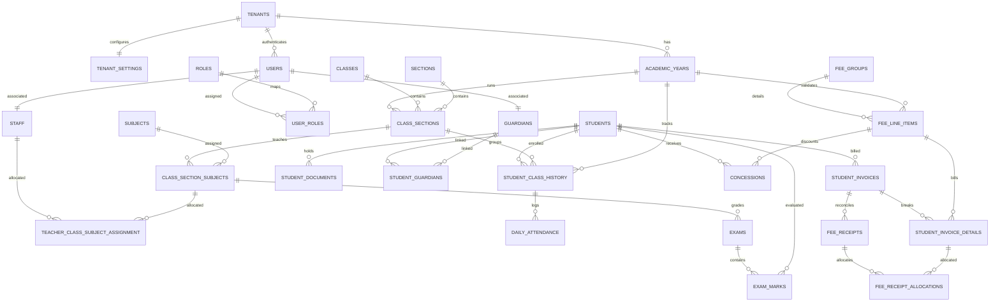

# Database Design Document: EduPulse AI
**Project Name:** EduPulse AI  
**Role Perspective:** Principal SQL Server Database Architect & SaaS Architect  
**Curriculum Scope:** K-12 Private Schools (India)  
**Target Database Engine:** Microsoft SQL Server 2022 (Express/Web/Standard/Enterprise)  
**SaaS Isolation Model:** Shared Database, Shared Schema (Row-Level Security)  
**Data Access Layer:** .NET 8 Web API via Dapper (Direct SQL Execution)  

---

## 1. Domain Model Overview

The EduPulse AI database model represents a unified, multi-tenant school ecosystem. The entities are designed to support a K-12 environment, allowing academic operations, student registries, parent mappings, fee schedules, CBSE grading, assignments, and notification trails to run in isolation per school.



---

## 2. Database Architecture

To scale a multi-tenant platform with a solo developer, we enforce a **Shared Database, Shared Schema** strategy.
* **Infrastructure Footprint:** A single SQL Server instance hosts the application data, maximizing connection pooling efficiency and eliminating database-per-tenant administration overhead.
* **Isolation Enforcement:** We construct SQL Server **Security Policies** containing inline table-valued security functions. These functions automatically apply a filter predicate (`WHERE TenantId = CONVERT(UNIQUEIDENTIFIER, SESSION_CONTEXT(N'TenantId'))`) on all queries. This isolates school accounts at the engine level, preventing accidental data leaks from raw SQL execution in Dapper.
* **Identity Mapping:** Primary keys are generated using `UNIQUEIDENTIFIER` with `DEFAULT NEWSEQUENTIALID()`. This minimizes index page fragmentation on clustered indexes compared to standard random UUIDs (`NEWID()`), while preserving tenant isolation when merging records for diagnostic profiling.

---

## 3. Table Inventory

The schema is divided into 13 logical groups to maintain clarity:

### 3.1. Tenant Management
1. **`Tenants`**: Main register of school clients.

### 3.2. Security & RBAC
2. **`Users`**: Authentication accounts.
3. **`Roles`**: System privilege profiles.
4. **`UserRoles`**: Mappings between users and roles.

### 3.3. Academic Structure
5. **`AcademicYears`**: Term limits (e.g. 2026-2027).
6. **`Classes`**: Class standards (LKG to 12th).
7. **`Sections`**: Divisions (A, B, C).
8. **`ClassSections`**: Mappings linking classes to active sections (with Homeroom teacher allocation).
9. **`Subjects`**: Curricular subjects.
10. **`ClassSectionSubjects`**: Subject configurations allocated to specific class sections.

### 3.4. Student Management
11. **`Students`**: Core student profiles with photo, demographics, and audit tracking.
12. **`StudentClassHistory`**: Year-specific student class mappings.
13. **`StudentDocuments`**: Digital scans repository (Aadhaar, TC, Birth Certificate).

### 3.5. Guardian Management
14. **`Guardians`**: Parent profile records.
15. **`StudentGuardians`**: Siblings and multi-parent mapping matrices.

### 3.6. Staff Management
16. **`Staff`**: Teacher and administrative records (with photo, Designation, and audit tracking).
17. **`TeacherClassSubjectAssignment`**: Classroom teaching allocations.

### 3.7. Attendance
18. **`DailyAttendance`**: Student presence logging.

### 3.8. Fees & Billing
19. **`FeeGroups`**: Fee categories (Tuition, Transport).
20. **`FeeLineItems`**: Specific charge definitions bound to Academic Years.
21. **`StudentInvoices`**: Generated student invoices with status indicators.
22. **`StudentInvoiceDetails`**: Line item billing breakdowns.
23. **`Concessions`**: Flat/percentage discount mapping.
24. **`FeeReceipts`**: Paid receipts ledger with cancellation audits.
25. **`FeeReceiptAllocations`**: Sub-ledger allocating partial receipt collections to specific billed details.

### 3.9. Examinations
26. **`Exams`**: Academic test schedules.
27. **`ExamMarks`**: Recorded student grade points.

### 3.10. Homework
28. **`Homework`**: Daily homework cards.

### 3.11. Notifications
29. **`NotificationLogs`**: Alert logs.

### 3.12. Audit & History
30. **`AuditLogs`**: Master changes audit trails.
31. **`StudentStatusHistory`**: Student lifecycle audit records.

### 3.13. Configuration
32. **`TenantSettings`**: General school parameters. *(Note: Integration keys and SMTP configurations are resolved via standard environment variables and appsettings.json config layers for the MVP, rather than db secrets table schema).*

---

## 4. Table Specifications

### 4.1. Tenant Management

#### Table: `Tenants`
* **Purpose:** Stores registered school organizations using the SaaS platform.
* **Columns:**
  | Column Name | SQL Type | Nullable | Default | Constraints / Description |
  | :--- | :--- | :---: | :--- | :--- |
  | `TenantId` | `UNIQUEIDENTIFIER` | NO | `NEWSEQUENTIALID()` | PK. Unique Tenant Identifier. |
  | `Name` | `NVARCHAR(150)` | NO | | Legal school name. |
  | `RegistrationNo` | `VARCHAR(50)` | NO | | Official school registration number. |
  | `IsActive` | `BIT` | NO | `1` | Activity flag. |
  | `CreatedOn` | `DATETIME2` | NO | `SYSUTCDATETIME()` | Timestamp of record creation. |
* **Unique Constraints:** `UQ_Tenants_RegistrationNo` on `RegistrationNo`
* **Recommended Indexes:** None (Clustered PK on `TenantId`).

---

### 4.2. Security & RBAC

#### Table: `Users`
* **Purpose:** User profiles for system access across all roles.
* **Columns:**
  | Column Name | SQL Type | Nullable | Default | Constraints / Description |
  | :--- | :--- | :---: | :--- | :--- |
  | `UserId` | `UNIQUEIDENTIFIER` | NO | `NEWSEQUENTIALID()` | PK. |
  | `TenantId` | `UNIQUEIDENTIFIER` | NO | | FK referencing `Tenants(TenantId)`. |
  | `Email` | `VARCHAR(100)` | NO | | Login credential. Unique per tenant. |
  | `PasswordHash` | `VARCHAR(255)` | NO | | Hashed representation. |
  | `IsActive` | `BIT` | NO | `1` | Account active flag. |
  | `CreatedOn` | `DATETIME2` | NO | `SYSUTCDATETIME()` | |
* **Unique Constraints:** `UQ_Users_Tenant_Email` on `(TenantId, Email)`
* **Recommended Indexes:**
  * `IX_Users_Tenant_Email` (Non-Clustered) on `(TenantId, Email)`

#### Table: `Roles`
* **Purpose:** Mappings of system roles.
* **Columns:**
  | Column Name | SQL Type | Nullable | Default | Constraints / Description |
  | :--- | :--- | :---: | :--- | :--- |
  | `RoleId` | `VARCHAR(30)` | NO | | PK. (e.g. `SuperAdmin`, `SchoolAdmin`, `Teacher`, `Parent`, `Accountant`). |
  | `Description` | `NVARCHAR(150)` | NO | | Context role description. |

#### Table: `UserRoles`
* **Purpose:** Mappings linking users to their roles.
* **Columns:**
  | Column Name | SQL Type | Nullable | Default | Constraints / Description |
  | :--- | :--- | :---: | :--- | :--- |
  | `UserId` | `UNIQUEIDENTIFIER` | NO | | PK, FK referencing `Users(UserId)`. |
  | `RoleId` | `VARCHAR(30)` | NO | | PK, FK referencing `Roles(RoleId)`. |
  | `TenantId` | `UNIQUEIDENTIFIER` | NO | | FK referencing `Tenants(TenantId)`. |

---

### 4.3. Academic Structure

#### Table: `AcademicYears`
* **Purpose:** Stores K-12 academic year boundaries.
* **Columns:**
  | Column Name | SQL Type | Nullable | Default | Constraints / Description |
  | :--- | :--- | :---: | :--- | :--- |
  | `AcademicYearId` | `UNIQUEIDENTIFIER` | NO | `NEWSEQUENTIALID()` | PK. |
  | `TenantId` | `UNIQUEIDENTIFIER` | NO | | FK referencing `Tenants(TenantId)`. |
  | `Name` | `VARCHAR(20)` | NO | | e.g. "2026-2027". |
  | `StartDate` | `DATE` | NO | | Start date. |
  | `EndDate` | `DATE` | NO | | End date. |
* **Unique Constraints:** `UQ_AcademicYears_Tenant_Name` on `(TenantId, Name)`
* **Check Constraints:** `CK_AcademicYears_Dates`: `EndDate > StartDate`

#### Table: `Classes`
* **Purpose:** Defines active school class levels.
* **Columns:**
  | Column Name | SQL Type | Nullable | Default | Constraints / Description |
  | :--- | :--- | :---: | :--- | :--- |
  | `ClassId` | `UNIQUEIDENTIFIER` | NO | `NEWSEQUENTIALID()` | PK. |
  | `TenantId` | `UNIQUEIDENTIFIER` | NO | | FK referencing `Tenants(TenantId)`. |
  | `Name` | `NVARCHAR(30)` | NO | | Class name (e.g., "Class 1", "LKG"). |
  | `SortOrder` | `INT` | NO | `0` | Order weight for sorting. |
* **Unique Constraints:** `UQ_Classes_Tenant_Name` on `(TenantId, Name)`

#### Table: `Sections`
* **Purpose:** Class section divisions.
* **Columns:**
  | Column Name | SQL Type | Nullable | Default | Constraints / Description |
  | :--- | :--- | :---: | :--- | :--- |
  | `SectionId` | `UNIQUEIDENTIFIER` | NO | `NEWSEQUENTIALID()` | PK. |
  | `TenantId` | `UNIQUEIDENTIFIER` | NO | | FK referencing `Tenants(TenantId)`. |
  | `Name` | `NVARCHAR(10)` | NO | | e.g. "Section A". |
* **Unique Constraints:** `UQ_Sections_Tenant_Name` on `(TenantId, Name)`

#### Table: `ClassSections`
* **Purpose:** Combines classes and sections for the active year.
* **Columns:**
  | Column Name | SQL Type | Nullable | Default | Constraints / Description |
  | :--- | :--- | :---: | :--- | :--- |
  | `ClassSectionId` | `UNIQUEIDENTIFIER` | NO | `NEWSEQUENTIALID()` | PK. |
  | `TenantId` | `UNIQUEIDENTIFIER` | NO | | FK referencing `Tenants(TenantId)`. |
  | `ClassId` | `UNIQUEIDENTIFIER` | NO | | FK referencing `Classes(ClassId)`. |
  | `SectionId` | `UNIQUEIDENTIFIER` | NO | | FK referencing `Sections(SectionId)`. |
  | `AcademicYearId` | `UNIQUEIDENTIFIER` | NO | | FK referencing `AcademicYears(AcademicYearId)`. |
  | `ClassTeacherId` | `UNIQUEIDENTIFIER` | YES | | FK referencing `Staff(StaffId)`. Mapped Homeroom Class Teacher. |
  | `Capacity` | `INT` | NO | `40` | Max students limit. |
* **Unique Constraints:** `UQ_ClassSections_Combo` on `(TenantId, ClassId, SectionId, AcademicYearId)`
* **Check Constraints:** `CK_ClassSections_Capacity`: `Capacity > 0`

#### Table: `Subjects`
* **Purpose:** List of core school subjects.
* **Columns:**
  | Column Name | SQL Type | Nullable | Default | Constraints / Description |
  | :--- | :--- | :---: | :--- | :--- |
  | `SubjectId` | `UNIQUEIDENTIFIER` | NO | `NEWSEQUENTIALID()` | PK. |
  | `TenantId` | `UNIQUEIDENTIFIER` | NO | | FK referencing `Tenants(TenantId)`. |
  | `Name` | `NVARCHAR(50)` | NO | | e.g., "Mathematics". |
  | `SubjectCode` | `VARCHAR(20)` | NO | | e.g. "MATH101". |
* **Unique Constraints:** `UQ_Subjects_Tenant_Code` on `(TenantId, SubjectCode)`

#### Table: `ClassSectionSubjects`
* **Purpose:** Configures subjects taught in a class section during the academic year.
* **Columns:**
  | Column Name | SQL Type | Nullable | Default | Constraints / Description |
  | :--- | :--- | :---: | :--- | :--- |
  | `ClassSectionSubjectId` | `UNIQUEIDENTIFIER` | NO | `NEWSEQUENTIALID()` | PK. |
  | `TenantId` | `UNIQUEIDENTIFIER` | NO | | FK referencing `Tenants(TenantId)`. |
  | `ClassSectionId` | `UNIQUEIDENTIFIER` | NO | | FK referencing `ClassSections(ClassSectionId)`. |
  | `SubjectId` | `UNIQUEIDENTIFIER` | NO | | FK referencing `Subjects(SubjectId)`. |
  | `EvaluationMode` | `VARCHAR(15)` | NO | `'Theory'` | Value constraint: `Theory`, `Practical`, `Mixed`. |
* **Unique Constraints:** `UQ_ClassSectionSubjects_Combo` on `(TenantId, ClassSectionId, SubjectId)`

---

### 3.4. Student Management

#### Table: `Students`
* **Purpose:** Core student registry with demographic parameters and audit properties.
* **Columns:**
  | Column Name | SQL Type | Nullable | Default | Constraints / Description |
  | :--- | :--- | :---: | :--- | :--- |
  | `StudentId` | `UNIQUEIDENTIFIER` | NO | `NEWSEQUENTIALID()` | PK. |
  | `TenantId` | `UNIQUEIDENTIFIER` | NO | | FK referencing `Tenants(TenantId)`. |
  | `AdmissionNo` | `VARCHAR(50)` | NO | | Unique enrollment identifier. |
  | `FirstName` | `NVARCHAR(100)` | NO | | Student first name. |
  | `LastName` | `NVARCHAR(100)` | NO | | Student last name. |
  | `DateOfBirth` | `DATE` | NO | | Date of birth. |
  | `Gender` | `VARCHAR(10)` | NO | | Enum values (e.g. `Male`, `Female`, `Other`). |
  | `BloodGroup` | `VARCHAR(5)` | YES | | Nullable blood type. |
  | `AadhaarNo` | `VARCHAR(100)` | YES | | Encrypted Aadhaar card number. Optional for MVP. |
  | `SocialCategory` | `VARCHAR(10)` | YES | | Optional check constraint. GEN, OBC, SC, ST. |
  | `PhotoPath` | `VARCHAR(500)` | YES | | Nullable path for profile picture (ID cards/Report cards). |
  | `AdmissionDate` | `DATE` | NO | | Date of admission. |
  | `Status` | `VARCHAR(20)` | NO | `'Applied'` | Check validation lifecycle value. |
  | `IsDeleted` | `BIT` | NO | `0` | Soft delete indicator. |
  | `CreatedOn` | `DATETIME2` | NO | `SYSUTCDATETIME()` | Audit: Record creation timestamp. |
  | `CreatedByUserId` | `UNIQUEIDENTIFIER` | NO | | Audit: FK referencing `Users(UserId)`. |
  | `ModifiedOn` | `DATETIME2` | YES | | Audit: Record last modified timestamp. |
  | `ModifiedByUserId`| `UNIQUEIDENTIFIER` | YES | | Audit: FK referencing `Users(UserId)`. |
* **Unique Constraints:** `UQ_Students_Tenant_AdmissionNo` on `(TenantId, AdmissionNo)`
* **Check Constraints:** 
  * `CK_Students_Status`: Check valid lifecycle values (`Applied`, `Admitted`, `Active`, `Promoted`, `Repeating`, `Transferred`, `Graduated`, `Dropped`, `Archived`).
  * `CK_Students_SocialCategory`: `SocialCategory IN ('GEN', 'OBC', 'SC', 'ST')`
* **Recommended Indexes:**
  * `IX_Students_Tenant_Status` (Non-Clustered) on `(TenantId, Status)` INCLUDE `(FirstName, LastName)`

#### Table: `StudentClassHistory`
* **Purpose:** Tracks student classes, sections, and roll numbers across academic years.
* **Columns:**
  | Column Name | SQL Type | Nullable | Default | Constraints / Description |
  | :--- | :--- | :---: | :--- | :--- |
  | `StudentClassHistoryId` | `UNIQUEIDENTIFIER` | NO | `NEWSEQUENTIALID()` | PK. |
  | `TenantId` | `UNIQUEIDENTIFIER` | NO | | FK referencing `Tenants(TenantId)`. |
  | `StudentId` | `UNIQUEIDENTIFIER` | NO | | FK referencing `Students(StudentId)`. |
  | `ClassSectionId` | `UNIQUEIDENTIFIER` | NO | | FK referencing `ClassSections(ClassSectionId)`. |
  | `AcademicYearId` | `UNIQUEIDENTIFIER` | NO | | FK referencing `AcademicYears(AcademicYearId)`. |
  | `RollNo` | `INT` | NO | | Class roll number. |
* **Unique Constraints:** 
  * `UQ_StudentClassHistory_Year_Roll` on `(TenantId, ClassSectionId, AcademicYearId, RollNo)`
  * `UQ_StudentClassHistory_Student_Year` on `(TenantId, StudentId, AcademicYearId)`
* **Recommended Indexes:**
  * `IX_StudentClassHistory_Student` (Non-Clustered) on `(TenantId, StudentId)`

#### Table: `StudentDocuments`
* **Purpose:** Registry table to track student physical document uploads (Aadhaar, Transfer Certificate, Birth Certificate).
* **Columns:**
  | Column Name | SQL Type | Nullable | Default | Constraints / Description |
  | :--- | :--- | :---: | :--- | :--- |
  | `DocumentId` | `UNIQUEIDENTIFIER` | NO | `NEWSEQUENTIALID()` | PK. |
  | `TenantId` | `UNIQUEIDENTIFIER` | NO | | FK referencing `Tenants(TenantId)`. |
  | `StudentId` | `UNIQUEIDENTIFIER` | NO | | FK referencing `Students(StudentId)`. |
  | `DocumentType` | `VARCHAR(30)` | NO | | `Aadhaar`, `TC`, `BirthCertificate`, `Other`. |
  | `FileName` | `NVARCHAR(250)` | NO | | Saved display name of the file. |
  | `FilePathKey` | `VARCHAR(500)` | NO | | Storage path key on local storage. |
  | `UploadedOn` | `DATETIME2` | NO | `SYSUTCDATETIME()` | Upload timestamp. |
  | `UploadedByUserId`| `UNIQUEIDENTIFIER` | NO | | FK referencing `Users(UserId)`. |
* **Check Constraints:** `CK_StudentDocuments_Type`: `DocumentType IN ('Aadhaar', 'TC', 'BirthCertificate', 'Other')`

---

### 3.5. Guardian Management

#### Table: `Guardians`
* **Purpose:** Parental information data.
* **Columns:**
  | Column Name | SQL Type | Nullable | Default | Constraints / Description |
  | :--- | :--- | :---: | :--- | :--- |
  | `GuardianId` | `UNIQUEIDENTIFIER` | NO | `NEWSEQUENTIALID()` | PK. |
  | `TenantId` | `UNIQUEIDENTIFIER` | NO | | FK referencing `Tenants(TenantId)`. |
  | `UserId` | `UNIQUEIDENTIFIER` | YES | | Nullable FK referencing `Users(UserId)` for portal access. |
  | `FirstName` | `NVARCHAR(100)` | NO | | Guardian first name. |
  | `LastName` | `NVARCHAR(100)` | NO | | Guardian last name. |
  | `Phone` | `VARCHAR(15)` | NO | | SMS/WhatsApp contact number. |
  | `Email` | `VARCHAR(100)` | YES | | Primary email. |
* **Unique Constraints:** `UQ_Guardians_Tenant_Phone` on `(TenantId, Phone)`

#### Table: `StudentGuardians`
* **Purpose:** Junction table linking students to multiple guardians.
* **Columns:**
  | Column Name | SQL Type | Nullable | Default | Constraints / Description |
  | :--- | :--- | :---: | :--- | :--- |
  | `StudentId` | `UNIQUEIDENTIFIER` | NO | | PK, FK referencing `Students(StudentId)`. |
  | `GuardianId` | `UNIQUEIDENTIFIER` | NO | | PK, FK referencing `Guardians(GuardianId)`. |
  | `TenantId` | `UNIQUEIDENTIFIER` | NO | | FK referencing `Tenants(TenantId)`. |
  | `RelationshipType` | `VARCHAR(20)` | NO | | e.g. `Father`, `Mother`, `Guardian`. |
  | `IsPrimaryContact` | `BIT` | NO | `0` | Alert dispatch receiver. |
  | `IsBillingResponsible`| `BIT` | NO | `0` | Ledger invoice recipient. |
* **Recommended Indexes:**
  * `IX_StudentGuardians_Guardian` (Non-Clustered) on `(TenantId, GuardianId)`

---

### 3.6. Staff Management

#### Table: `Staff`
* **Purpose:** Employee records registry.
* **Columns:**
  | Column Name | SQL Type | Nullable | Default | Constraints / Description |
  | :--- | :--- | :---: | :--- | :--- |
  | `StaffId` | `UNIQUEIDENTIFIER` | NO | `NEWSEQUENTIALID()` | PK. |
  | `TenantId` | `UNIQUEIDENTIFIER` | NO | | FK referencing `Tenants(TenantId)`. |
  | `UserId` | `UNIQUEIDENTIFIER` | YES | | Nullable FK referencing `Users(UserId)` for portal access. |
  | `EmployeeCode` | `VARCHAR(50)` | NO | | Unique employee identifier. |
  | `FirstName` | `NVARCHAR(100)` | NO | | First name. |
  | `LastName` | `NVARCHAR(100)` | NO | | Last name. |
  | `Phone` | `VARCHAR(15)` | NO | | Mobile contact. |
  | `Designation` | `VARCHAR(50)` | YES | | e.g., 'TGT Science', 'Accountant', 'Principal'. |
  | `PhotoPath` | `VARCHAR(500)` | YES | | Nullable path for profile picture. |
  | `IsActive` | `BIT` | NO | `1` | Activity indicator. |
  | `CreatedOn` | `DATETIME2` | NO | `SYSUTCDATETIME()` | Audit: Record creation timestamp. |
  | `CreatedByUserId` | `UNIQUEIDENTIFIER` | NO | | Audit: FK referencing `Users(UserId)`. |
  | `ModifiedOn` | `DATETIME2` | YES | | Audit: Record last modified timestamp. |
  | `ModifiedByUserId`| `UNIQUEIDENTIFIER` | YES | | Audit: FK referencing `Users(UserId)`. |
* **Unique Constraints:** `UQ_Staff_Tenant_Code` on `(TenantId, EmployeeCode)`

#### Table: `TeacherClassSubjectAssignment`
* **Purpose:** Maps teachers to specific subjects and class sections.
* **Columns:**
  | Column Name | SQL Type | Nullable | Default | Constraints / Description |
  | :--- | :--- | :---: | :--- | :--- |
  | `AssignmentId` | `UNIQUEIDENTIFIER` | NO | `NEWSEQUENTIALID()` | PK. |
  | `TenantId` | `UNIQUEIDENTIFIER` | NO | | FK referencing `Tenants(TenantId)`. |
  | `StaffId` | `UNIQUEIDENTIFIER` | NO | | FK referencing `Staff(StaffId)` (Must be active). |
  | `ClassSectionSubjectId`| `UNIQUEIDENTIFIER`| NO | | FK referencing `ClassSectionSubjects`. |
  | `AcademicYearId` | `UNIQUEIDENTIFIER` | NO | | FK referencing `AcademicYears(AcademicYearId)`. |
* **Unique Constraints:** `UQ_TeacherClassSubjectAssignment_Unique` on `(TenantId, ClassSectionSubjectId, AcademicYearId)`

---

### 3.7. Attendance

#### Table: `DailyAttendance`
* **Purpose:** Records daily student attendance logs.
* **Columns:**
  | Column Name | SQL Type | Nullable | Default | Constraints / Description |
  | :--- | :--- | :---: | :--- | :--- |
  | `AttendanceId` | `UNIQUEIDENTIFIER` | NO | `NEWSEQUENTIALID()` | PK. |
  | `TenantId` | `UNIQUEIDENTIFIER` | NO | | FK referencing `Tenants(TenantId)`. |
  | `StudentClassHistoryId`| `UNIQUEIDENTIFIER`| NO | | FK referencing `StudentClassHistory`. |
  | `Date` | `DATE` | NO | | Log date. |
  | `Status` | `CHAR(1)` | NO | | `P` (Present), `A` (Absent), `L` (Leave), `T` (Late). |
  | `CheckInTime` | `TIME` | YES | | Nullable, logged if status is `T`. |
  | `ChangedByUserId` | `UNIQUEIDENTIFIER` | NO | | FK referencing `Users(UserId)`. |
* **Unique Constraints:** `UQ_DailyAttendance_Key` on `(TenantId, StudentClassHistoryId, Date)`
* **Check Constraints:** `CK_DailyAttendance_Status`: `Status IN ('P', 'A', 'L', 'T')`
* **Recommended Indexes:**
  * `IX_DailyAttendance_Date_Status` (Non-Clustered) on `(TenantId, Date, Status)`

---

### 3.8. Fees & Billing

#### Table: `FeeGroups`
* **Purpose:** Defines billing categories.
* **Columns:**
  | Column Name | SQL Type | Nullable | Default | Constraints / Description |
  | :--- | :--- | :---: | :--- | :--- |
  | `FeeGroupId` | `UNIQUEIDENTIFIER` | NO | `NEWSEQUENTIALID()` | PK. |
  | `TenantId` | `UNIQUEIDENTIFIER` | NO | | FK referencing `Tenants(TenantId)`. |
  | `Name` | `NVARCHAR(50)` | NO | | e.g. "Tuition Fees", "Transport Fees". |

#### Table: `FeeLineItems`
* **Purpose:** Specific billable items mapped to classes/categories.
* **Columns:**
  | Column Name | SQL Type | Nullable | Default | Constraints / Description |
  | :--- | :--- | :---: | :--- | :--- |
  | `FeeLineItemId` | `UNIQUEIDENTIFIER` | NO | `NEWSEQUENTIALID()` | PK. |
  | `TenantId` | `UNIQUEIDENTIFIER` | NO | | FK referencing `Tenants(TenantId)`. |
  | `FeeGroupId` | `UNIQUEIDENTIFIER` | NO | | FK referencing `FeeGroups(FeeGroupId)`. |
  | `ClassId` | `UNIQUEIDENTIFIER` | YES | | Nullable. If null, applies to all classes. |
  | `AcademicYearId` | `UNIQUEIDENTIFIER` | NO | | FK referencing `AcademicYears(AcademicYearId)`. Fee rate mapping. |
  | `Name` | `NVARCHAR(100)` | NO | | e.g., "Tuition Fee Term 1". |
  | `Amount` | `DECIMAL(18,2)` | NO | | Charge value. |
* **Check Constraints:** `CK_FeeLineItems_Amount`: `Amount >= 0`

#### Table: `StudentInvoices`
* **Purpose:** Generated student invoices with state auditing columns.
* **Columns:**
  | Column Name | SQL Type | Nullable | Default | Constraints / Description |
  | :--- | :--- | :---: | :--- | :--- |
  | `InvoiceId` | `UNIQUEIDENTIFIER` | NO | `NEWSEQUENTIALID()` | PK. |
  | `TenantId` | `UNIQUEIDENTIFIER` | NO | | FK referencing `Tenants(TenantId)`. |
  | `StudentId` | `UNIQUEIDENTIFIER` | NO | | FK referencing `Students(StudentId)`. |
  | `AcademicYearId` | `UNIQUEIDENTIFIER` | NO | | FK referencing `AcademicYears(AcademicYearId)`. |
  | `InvoiceNo` | `VARCHAR(30)` | NO | | Unique billing invoice code. |
  | `InvoiceStatus` | `VARCHAR(20)` | NO | `'Draft'` | Check constraint enum (Draft, Pending, Paid, etc). |
  | `DueDate` | `DATE` | NO | | Deadline for payment. |
  | `TotalAmount` | `DECIMAL(18,2)` | NO | | Raw billing sum. |
  | `ConcessionAmount` | `DECIMAL(18,2)` | NO | `0` | Deductions sum. |
  | `PaidAmount` | `DECIMAL(18,2)` | NO | `0` | Completed collections sum. |
  | `BalanceAmount` | `DECIMAL(18,2)` | NO | | Computed: `TotalAmount - ConcessionAmount - PaidAmount`. |
* **Unique Constraints:** `UQ_StudentInvoices_No` on `(TenantId, InvoiceNo)`
* **Check Constraints:** 
  * `CK_StudentInvoices_Amounts`: `TotalAmount >= 0 AND ConcessionAmount >= 0 AND PaidAmount >= 0`
  * `CK_StudentInvoices_Balance`: `BalanceAmount >= 0`
  * `CK_StudentInvoices_Status`: `InvoiceStatus IN ('Draft', 'Pending', 'PartiallyPaid', 'Paid', 'Overdue', 'Cancelled')`
* **Recommended Indexes:**
  * `IX_StudentInvoices_Student_Balance` (Non-Clustered) on `(TenantId, StudentId)` INCLUDE `(BalanceAmount)`

#### Table: `StudentInvoiceDetails`
* **Purpose:** Breakdown of individual line items within an invoice.
* **Columns:**
  | Column Name | SQL Type | Nullable | Default | Constraints / Description |
  | :--- | :--- | :---: | :--- | :--- |
  | `InvoiceDetailId` | `UNIQUEIDENTIFIER` | NO | `NEWSEQUENTIALID()` | PK. |
  | `TenantId` | `UNIQUEIDENTIFIER` | NO | | FK referencing `Tenants(TenantId)`. |
  | `InvoiceId` | `UNIQUEIDENTIFIER` | NO | | FK referencing `StudentInvoices(InvoiceId)`. |
  | `FeeLineItemId` | `UNIQUEIDENTIFIER` | NO | | FK referencing `FeeLineItems`. |
  | `Amount` | `DECIMAL(18,2)` | NO | | Item billed amount. |

#### Table: `Concessions`
* **Purpose:** Stores approved fee concessions and scholarships for students.
* **Columns:**
  | Column Name | SQL Type | Nullable | Default | Constraints / Description |
  | :--- | :--- | :---: | :--- | :--- |
  | `ConcessionId` | `UNIQUEIDENTIFIER` | NO | `NEWSEQUENTIALID()` | PK. |
  | `TenantId` | `UNIQUEIDENTIFIER` | NO | | FK referencing `Tenants(TenantId)`. |
  | `StudentId` | `UNIQUEIDENTIFIER` | NO | | FK referencing `Students(StudentId)`. |
  | `FeeLineItemId` | `UNIQUEIDENTIFIER` | NO | | FK referencing `FeeLineItems`. |
  | `Type` | `VARCHAR(15)` | NO | | `Percentage` or `FixedAmount`. |
  | `Value` | `DECIMAL(18,2)` | NO | | Concession value (Percentage rate or amount). |
  | `ApprovalCode` | `VARCHAR(50)` | NO | | Required registration audit code. |
  | `ApprovedByUserId`| `UNIQUEIDENTIFIER`| NO | | FK referencing `Users(UserId)`. |
* **Check Constraints:** `CK_Concessions_Type`: `Type IN ('Percentage', 'FixedAmount')`

#### Table: `FeeReceipts`
* **Purpose:** Transaction ledger recording invoice payments.
* **Columns:**
  | Column Name | SQL Type | Nullable | Default | Constraints / Description |
  | :--- | :--- | :---: | :--- | :--- |
  | `ReceiptId` | `UNIQUEIDENTIFIER` | NO | `NEWSEQUENTIALID()` | PK. |
  | `TenantId` | `UNIQUEIDENTIFIER` | NO | | FK referencing `Tenants(TenantId)`. |
  | `InvoiceId` | `UNIQUEIDENTIFIER` | NO | | FK referencing `StudentInvoices(InvoiceId)`. |
  | `ReceiptNo` | `VARCHAR(30)` | NO | | Structured serial number. |
  | `AmountPaid` | `DECIMAL(18,2)` | NO | | Collected currency amount. |
  | `PaymentDate` | `DATETIME2` | NO | `SYSUTCDATETIME()` | Payment date. |
  | `PaymentMethod` | `VARCHAR(20)` | NO | | `Cash`, `Cheque`, `UPI`, `Card`. |
  | `TransactionRef` | `VARCHAR(100)` | YES | | Nullable (Required for UPI/Cheques). |
  | `CollectedByUserId`| `UNIQUEIDENTIFIER`| NO | | FK referencing `Users(UserId)`. |
  | `IsCancelled` | `BIT` | NO | `0` | Reversal audit indicator. |
  | `CancelledOn` | `DATETIME2` | YES | | Nullable timestamp. |
  | `CancelledByUserId`| `UNIQUEIDENTIFIER` | YES | | FK referencing `Users(UserId)`. |
  | `CancellationReason`| `NVARCHAR(250)`| YES | | Audit note explanation. |
* **Unique Constraints:** `UQ_FeeReceipts_No` on `(TenantId, ReceiptNo)`
* **Check Constraints:** 
  * `CK_FeeReceipts_Amount`: `AmountPaid > 0`
  * `CK_FeeReceipts_Method`: `PaymentMethod IN ('Cash', 'Cheque', 'UPI', 'Card')`

#### Table: `FeeReceiptAllocations`
* **Purpose:** Distributes payment amounts across billed line items to permit partial payment bookkeeping.
* **Columns:**
  | Column Name | SQL Type | Nullable | Default | Constraints / Description |
  | :--- | :--- | :---: | :--- | :--- |
  | `AllocationId` | `UNIQUEIDENTIFIER` | NO | `NEWSEQUENTIALID()` | PK. |
  | `TenantId` | `UNIQUEIDENTIFIER` | NO | | FK referencing `Tenants(TenantId)`. |
  | `ReceiptId` | `UNIQUEIDENTIFIER` | NO | | FK referencing `FeeReceipts(ReceiptId)`. |
  | `InvoiceDetailId` | `UNIQUEIDENTIFIER` | NO | | FK referencing `StudentInvoiceDetails(InvoiceDetailId)`. |
  | `AmountAllocated` | `DECIMAL(18,2)` | NO | | Assigned cash allocation. |
  | `CreatedOn` | `DATETIME2` | NO | `SYSUTCDATETIME()` | Audit log timestamp. |
* **Unique Constraints:** `UQ_FeeReceiptAllocations_ReceiptDetail` on `(TenantId, ReceiptId, InvoiceDetailId)`
* **Check Constraints:** `CK_FeeReceiptAllocations_Amount`: `AmountAllocated > 0`

---

### 3.9. Examinations

#### Table: `Exams`
* **Purpose:** Tracks scheduled exams.
* **Columns:**
  | Column Name | SQL Type | Nullable | Default | Constraints / Description |
  | :--- | :--- | :---: | :--- | :--- |
  | `ExamId` | `UNIQUEIDENTIFIER` | NO | `NEWSEQUENTIALID()` | PK. |
  | `TenantId` | `UNIQUEIDENTIFIER` | NO | | FK referencing `Tenants(TenantId)`. |
  | `ClassSectionSubjectId`| `UNIQUEIDENTIFIER`| NO | | FK referencing `ClassSectionSubjects`. |
  | `Name` | `NVARCHAR(100)` | NO | | e.g., "Term 1 Final". |
  | `MaxMarks` | `INT` | NO | `100` | Exam max score. |
  | `ExamDate` | `DATE` | NO | | Exam date. |
  | `IsPublished` | `BIT` | NO | `0` | Visibility to parents. |
* **Check Constraints:** `CK_Exams_MaxMarks`: `MaxMarks > 0`

#### Table: `ExamMarks`
* **Purpose:** Recorded scores for exams.
* **Columns:**
  | Column Name | SQL Type | Nullable | Default | Constraints / Description |
  | :--- | :--- | :---: | :--- | :--- |
  | `ExamMarkId` | `UNIQUEIDENTIFIER` | NO | `NEWSEQUENTIALID()` | PK. |
  | `TenantId` | `UNIQUEIDENTIFIER` | NO | | FK referencing `Tenants(TenantId)`. |
  | `ExamId` | `UNIQUEIDENTIFIER` | NO | | FK referencing `Exams(ExamId)`. |
  | `StudentId` | `UNIQUEIDENTIFIER` | NO | | FK referencing `Students(StudentId)`. |
  | `MarksObtained` | `DECIMAL(5,2)` | NO | | Score value. |
  | `IsAbsent` | `BIT` | NO | `0` | Absence flag. |
  | `TeacherRemarks` | `NVARCHAR(250)` | YES | | Optional remarks. |
  | `GradedByUserId` | `UNIQUEIDENTIFIER` | NO | | FK referencing `Users(UserId)`. |
* **Unique Constraints:** `UQ_ExamMarks_Combo` on `(TenantId, ExamId, StudentId)`
* **Check Constraints:** `CK_ExamMarks_Value`: `MarksObtained >= 0`

---

### 3.10. Homework

#### Table: `Homework`
* **Purpose:** Homework assignments diary.
* **Columns:**
  | Column Name | SQL Type | Nullable | Default | Constraints / Description |
  | :--- | :--- | :---: | :--- | :--- |
  | `HomeworkId` | `UNIQUEIDENTIFIER` | NO | `NEWSEQUENTIALID()` | PK. |
  | `TenantId` | `UNIQUEIDENTIFIER` | NO | | FK referencing `Tenants(TenantId)`. |
  | `ClassSectionSubjectId`| `UNIQUEIDENTIFIER`| NO | | FK referencing `ClassSectionSubjects`. |
  | `Title` | `NVARCHAR(100)` | NO | | Homework title. |
  | `Description` | `NVARCHAR(1000)`| NO | | Detailed instructions. |
  | `IssuedDate` | `DATE` | NO | | Date assigned. |
  | `DueDate` | `DATE` | NO | | Date due. |
  | `AttachmentPath` | `VARCHAR(500)` | YES | | Nullable local storage reference link. |
  | `CreatedByUserId` | `UNIQUEIDENTIFIER` | NO | | FK referencing `Users(UserId)`. |
* **Check Constraints:** `CK_Homework_Dates`: `DueDate >= IssuedDate`

---

### 3.11. Notifications

#### Table: `NotificationLogs`
* **Purpose:** Queue logs tracking message alerts.
* **Columns:**
  | Column Name | SQL Type | Nullable | Default | Constraints / Description |
  | :--- | :--- | :---: | :--- | :--- |
  | `NotificationId` | `UNIQUEIDENTIFIER` | NO | `NEWSEQUENTIALID()` | PK. |
  | `TenantId` | `UNIQUEIDENTIFIER` | NO | | FK referencing `Tenants(TenantId)`. |
  | `RecipientPhone` | `VARCHAR(15)` | NO | | Recipient phone number. |
  | `MessageBody` | `NVARCHAR(500)` | NO | | Text payload. |
  | `Status` | `VARCHAR(15)` | NO | `'Pending'` | `Pending`, `Sent`, `Delivered`, `Failed`. |
  | `RetryCount` | `INT` | NO | `0` | Number of attempts. |
  | `ErrorMessage` | `NVARCHAR(250)` | YES | | Nullable carrier error details. |
  | `CreatedOn` | `DATETIME2` | NO | `SYSUTCDATETIME()` | Entry timestamp. |
  | `SentOn` | `DATETIME2` | YES | | Delivery completion timestamp. |
* **Check Constraints:** `CK_NotificationLogs_Status`: `Status IN ('Pending', 'Sent', 'Delivered', 'Failed')`
* **Recommended Indexes:**
  * `IX_NotificationLogs_Status` (Non-Clustered) on `(TenantId, Status)`

---

### 3.12. Audit & History

#### Table: `AuditLogs`
* **Purpose:** Stores comprehensive system audit trails.
* **Columns:**
  | Column Name | SQL Type | Nullable | Default | Constraints / Description |
  | :--- | :--- | :---: | :--- | :--- |
  | `AuditLogId` | `UNIQUEIDENTIFIER` | NO | `NEWSEQUENTIALID()` | PK. |
  | `TenantId` | `UNIQUEIDENTIFIER` | NO | | FK referencing `Tenants(TenantId)`. |
  | `UserId` | `UNIQUEIDENTIFIER` | NO | | Executing user key. |
  | `Action` | `VARCHAR(100)` | NO | | e.g. `CollectFees`, `UpdateGrades`. |
  | `Timestamp` | `DATETIME2` | NO | `SYSUTCDATETIME()` | UTC timestamp. |
  | `IPAddress` | `VARCHAR(45)` | NO | | Client IP address context. |
  | `Payload` | `NVARCHAR(MAX)` | NO | | JSON payload details of changes. |

#### Table: `StudentStatusHistory`
* **Purpose:** Audit logs for student lifecycle status transitions.
* **Columns:**
  | Column Name | SQL Type | Nullable | Default | Constraints / Description |
  | :--- | :--- | :---: | :--- | :--- |
  | `StudentStatusHistoryId`| `UNIQUEIDENTIFIER`| NO | `NEWSEQUENTIALID()` | PK. |
  | `TenantId` | `UNIQUEIDENTIFIER` | NO | | FK referencing `Tenants(TenantId)`. |
  | `StudentId` | `UNIQUEIDENTIFIER` | NO | | FK referencing `Students(StudentId)`. |
  | `OldStatus` | `VARCHAR(20)` | YES | | Nullable (Null represents initial application). |
  | `NewStatus` | `VARCHAR(20)` | NO | | Target status. |
  | `ChangeReason` | `NVARCHAR(250)` | NO | | Explanation text. |
  | `ChangedByUserId` | `UNIQUEIDENTIFIER` | NO | | FK referencing `Users(UserId)`. |
  | `ChangedOn` | `DATETIME2` | NO | `SYSUTCDATETIME()` | Timestamp. |
  | `AcademicYearId` | `UNIQUEIDENTIFIER` | NO | | FK referencing `AcademicYears(AcademicYearId)`. |
* **Recommended Indexes:**
  * `IX_StudentStatusHistory_Student` (Non-Clustered) on `(TenantId, StudentId, ChangedOn DESC)`

---

### 3.13. Configuration

#### Table: `TenantSettings`
* **Purpose:** Global settings for each tenant.
* **Columns:**
  | Column Name | SQL Type | Nullable | Default | Constraints / Description |
  | :--- | :--- | :---: | :--- | :--- |
  | `TenantId` | `UNIQUEIDENTIFIER` | NO | | PK, FK referencing `Tenants(TenantId)`. |
  | `ActiveAcademicYearId` | `UNIQUEIDENTIFIER` | YES | | Nullable FK referencing `AcademicYears`. |
  | `SchoolCode` | `VARCHAR(20)` | NO | | Short branch identifier. |
  | `SchoolName` | `NVARCHAR(150)` | NO | | Mapped brand name. |
  | `LogoPath` | `VARCHAR(500)` | YES | | Local volume storage file pointer. |
  | `AttendanceCutoffTime` | `TIME` | NO | `'09:30:00'` | Cutoff time for attendance logs. |
  | `ReceiptPrefix` | `VARCHAR(10)` | NO | `'REC-'` | Prefix for fee receipts. |
  | `TCPrefix` | `VARCHAR(10)` | NO | `'TC-'` | Prefix for transfer certificates. |
  | `TimeZone` | `VARCHAR(50)` | NO | `'India Standard Time'`| System timezone config. |
  | `DateFormat` | `VARCHAR(20)` | NO | `'dd/MM/yyyy'` | Format config. |
  | `CreatedOn` | `DATETIME2` | NO | `SYSUTCDATETIME()` | |
  | `ModifiedOn` | `DATETIME2` | NO | `SYSUTCDATETIME()` | |
* **Unique Constraints:** `UQ_TenantSettings_Code` on `(SchoolCode)`

---

## 5. Multi-Tenant Strategy

EduPulse AI implements multi-tenancy using SQL Server **Row-Level Security (RLS)** using connection contexts.

### 5.1. Session Context Injection
In .NET 8, every Dapper database connection executes a command immediately after opening:
```sql
EXEC sp_set_session_context @key=N'TenantId', @value=@TenantId, @read_only=1;
```
This sets `TenantId` as a session context variable on the current TCP connection block.

### 5.2. Security Predicate Creation
A security function evaluates row authorization based on this context:
```sql
CREATE FUNCTION Security.fn_securitypredicate(@TenantId UNIQUEIDENTIFIER)
    RETURNS TABLE
WITH SCHEMABINDING
AS
    RETURN SELECT 1 AS fn_securitypredicate_result
    WHERE @TenantId = CONVERT(UNIQUEIDENTIFIER, SESSION_CONTEXT(N'TenantId'));
```

### 5.3. RLS Security Policy
The RLS filter policy is applied to all tenant-scoped tables:
```sql
CREATE SECURITY POLICY Security.TenantSecurityPolicy
ADD FILTER PREDICATE Security.fn_securitypredicate(TenantId) ON dbo.Students,
ADD BLOCK PREDICATE Security.fn_securitypredicate(TenantId) ON dbo.Students,
ADD FILTER PREDICATE Security.fn_securitypredicate(TenantId) ON dbo.DailyAttendance,
ADD BLOCK PREDICATE Security.fn_securitypredicate(TenantId) ON dbo.DailyAttendance
-- Applied to all tables containing a TenantId column...
```
* **Filter Predicate:** Restricts read operations (`SELECT`) to rows matching the active tenant.
* **Block Predicate:** Blocks write operations (`INSERT`, `UPDATE`) that attempt to create or modify data with a different `TenantId` than the active connection context.

---

## 6. Soft Delete Strategy

To ensure data integrity, core entities (`Students`, `Staff`, `Invoices`) are not deleted using hard SQL `DELETE` operations. Instead, a **Soft Delete** strategy is applied.

### 6.1. Audit Columns
Soft-delete entities contain dedicated tracking fields:
* `IsDeleted` (`BIT` DEFAULT `0`)
* `DeletedOn` (`DATETIME2` Nullable)
* `DeletedByUserId` (`UNIQUEIDENTIFIER` Nullable)

### 6.2. Filter Rules
To prevent soft-deleted rows from appearing in queries, SQL Server Views are created, or queries automatically apply filtering at the application layer:
```sql
-- Dapper Query mapping
SELECT * FROM Students WHERE IsDeleted = 0;
```
* **Data Integrity Protection:** Cascading deletes are disabled at the SQL Server foreign key level (`ON DELETE NO ACTION`). Attempting to soft-delete a student with existing fee ledger records or exam grades leaves those records intact, preserving financial reports.

---

## 7. Audit Strategy

Audit tracking is split into two systems to balance performance and compliance:

### 7.1. Database-Level Transaction Logs (`AuditLogs`)
Logs changes to critical financial and security records (e.g. concessions, receipts, user status changes).
* **Execution Pattern:** Write operations in the C# repository are wrapped in transactional services that write the old and new data state to the `AuditLogs` table as a JSON payload.
* **Format:**
  ```json
  {
    "Entity": "Concession",
    "Key": "A4C9B321-4E10-4820-BBF5-894C244243F2",
    "Changes": {
      "ConcessionAmount": { "Before": 0.00, "After": 1500.00 }
    }
  }
  ```

### 7.2. System Event Logging
Standard application logs (e.g. login attempts, validation warnings, SMS carrier responses) are logged by **Serilog** directly to console standard output, which is collected by Azure Monitor / AWS CloudWatch.

---

## 8. StudentStatusHistory Design

The `StudentStatusHistory` table tracks student lifecycle transitions (defined in section 4.12).

### 8.1. State Change Automation
* **API Transaction Scope:** When the status changes (e.g., from `Active` to `Transferred`), the service updates the `Status` column in `Students` and inserts a matching log row in `StudentStatusHistory` within a single SQL transaction.
* **Integrity Guard:** The database schema restricts status values using a check constraint (`CK_Students_Status`), enforcing correct state transitions.

---

## 9. TenantSettings Design

General school configurations are stored in `TenantSettings` (defined in section 4.13).

### 9.1. Cached Retrieval Architecture
* **Caching Layer:** On application start, the .NET Web API fetches settings matching the tenant ID and caches them in memory.
* **Cache Invalidation:** The cache is updated when settings are changed using a thread-safe invalidation token. This reduces database queries for static parameters (like `AttendanceCutoffTime` and `ReceiptPrefix`) to zero.
* **Secrets Management:** Integration credentials (SMTP host settings, payment integrations, SMS API tokens) are resolved at runtime directly from server environment variables and the `appsettings.json` configuration file, avoiding the complexity and security risk of an encrypted database secrets table for the MVP.

---

## 10. Academic Year Partitioning Strategy

As data volumes grow over multiple academic years, the database strategy must prevent query performance degradation without requiring hardware upgrades.

### 10.1. SQL Server Table Partitioning
Large operational tables (`DailyAttendance`, `ExamMarks`, `NotificationLogs`) are partitioned by **Range** using `AcademicYearId` or Year boundaries:
* **Partition Key:** The tables include a `YearBoundary` column (computed automatically or mapped directly).
* **Partition Scheme:** Historical years are mapped to slower storage partitions, while the current active academic year resides in high-speed storage.
* **Performance Gain:** Queries for current student attendance are routed directly to the active partition block, bypassing old historical records.

---

## 11. Performance & Indexing Strategy

### 11.1. Parameter Sniffing & Dapper Optimization
* **Index Plan:** Foreign keys are explicitly indexed to prevent index scans during table joins.
* **Clustered Indexes:** Set on primary keys (`UNIQUEIDENTIFIER` with `NEWSEQUENTIALID()`) to minimize physical fragmentation.
* **Covering Indexes:** Recommends composite indexes that include commonly queried columns:
  * `IX_StudentInvoices_Student_Balance` covers student billing balances directly from the index, eliminating table lookups during dashboard checks.

---

## 12. Backup & Archival Strategy

### 12.1. Backup Policy
To ensure recovery compliance (RTO: 4 Hours, RPO: 1 Hour):
* **Transaction Log Backups:** Executed automatically every 15 minutes.
* **Differential Backups:** Executed every 12 hours.
* **Full Backups:** Executed weekly.
* **Storage:** Encrypted backups are stored in geo-redundant storage buckets (e.g., AWS S3 with Glacier recovery policies).

### 12.2. Data Archival
* **Archived Status:** Students marked as `Archived` have their records locked.
* **Cold Storage Migration:** At the end of the year, logs for students archived for more than 5 years are exported to cold storage tables (or read-only filegroups) to keep the active database small and responsive.
