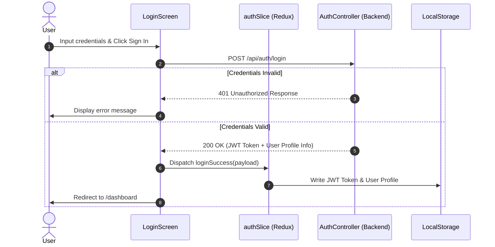

# Frontend Architecture: EduPulse School ERP SaaS (Sprint 3)

**Product Name:** EduPulse School ERP SaaS  
**Target Frameworks & Tools:** React 19, Vite, Redux Toolkit, React Router v6, Axios, Bootstrap 5  
**Style System:** Vanilla CSS (Design Tokens mapped in `DesignSystem.md`) + Bootstrap 5 Layout Utilities  
**Status:** Architecture Design Freeze  

This document specifies the technical design, directory structures, state management rules, routing controls, and API handling conventions for the EduPulse React single-page application.

---

## 1. Folder Structure

The frontend is organized using a **feature-modular** layout. Shared utilities, services, and structural layouts live in the core system directories, while business modules live inside features folders.

```text
src/
├── assets/                    # Static assets (logos, illustrations)
├── components/                # Reusable UI components (buttons, badges, inputs, skeletons)
│   ├── ui/                    # Pure presentational controls
│   └── feedback/              # Loaders, empty states, modals, error boundaries
├── features/                  # Business feature directories (self-contained modules)
│   ├── auth/                  # Login, JWT parsing, profiles
│   ├── academics/             # Academic Years, Classes, Sections configuration
│   ├── staff/                 # Staff Directory registers
│   ├── students/              # Student roster records and guardian links
│   └── attendance/            # Marking grids, log tables, summary analytics
├── hooks/                     # Custom global React hooks (useAuth, useQuery)
├── layouts/                   # Structural page templates (MainLayout, AuthLayout)
├── routes/                    # Navigation and route configurations (AppRoutes, ProtectedRoute)
├── services/                  # HTTP client initialization and API wrappers
├── store/                     # Redux Toolkit global store configuration and root reducer
├── styles/                    # Global stylesheet files (index.css with Design System tokens)
├── utils/                     # Utility helpers (formatters, JWT decoders, date helpers)
├── App.jsx                    # Root component containing providers
└── main.jsx                   # Application entry point
```

---

## 2. Route Structure

EduPulse routes are defined declaratively using React Router. Mapped paths align with the completed backend controllers.

| Route Path | Layout | Component | Access Permission (Allowed Roles) |
| :--- | :--- | :--- | :--- |
| `/login` | `AuthLayout` | `LoginScreen` | Anonymous |
| `/dashboard` | `MainLayout` | `DashboardResolver` | All Authenticated Users |
| `/settings/academic-years` | `MainLayout` | `AcademicYearManager` | `SchoolAdmin` |
| `/settings/classes` | `MainLayout` | `ClassManager` | `SchoolAdmin` |
| `/settings/sections` | `MainLayout` | `SectionManager` | `SchoolAdmin` |
| `/staff` | `MainLayout` | `StaffDirectory` | `SchoolAdmin` |
| `/students` | `MainLayout` | `StudentDirectory` | `SchoolAdmin`, `Teacher` |
| `/students/create` | `MainLayout` | `StudentCreateEdit` (Register) | `SchoolAdmin` |
| `/students/edit/:id` | `MainLayout` | `StudentCreateEdit` (Update) | `SchoolAdmin` |
| `/students/:id/guardians` | `MainLayout` | `StudentGuardianLinker` | `SchoolAdmin` |
| `/guardians` | `MainLayout` | `GuardianDirectory` | `SchoolAdmin` |
| `/attendance/mark` | `MainLayout` | `DailyAttendanceSheet` | `SchoolAdmin`, `Teacher` |
| `/attendance/history/:id` | `MainLayout` | `StudentAttendanceHistory` | `SchoolAdmin`, `Teacher`, `Parent` |
| `/attendance/analytics` | `MainLayout` | `ClassAttendanceDashboard` | `SchoolAdmin`, `Teacher` |

---

## 3. Layout Architecture

Layouts organize page regions and handle global navigation shells.

* **`AuthLayout`:** 
  * Centered one-column grid system layout.
  * Displays public content without sidebars or top bars.
  * Wraps the Login card component.
* **`MainLayout`:**
  * Displays a two-column responsive template: Fixed left-side Sidebar, top Header bar, and scrollable content frame.
  * Holds the global sidebar menu state (expanded/collapsed on mobile viewports).
  * Houses the Global Academic Year picker inside the Header section. When changes are made, the active selection is stored in the Redux store, triggering data updates on child pages.

---

## 4. Redux Store Structure

The global store utilizes Redux Toolkit. It coordinates auth credentials, global filter contexts, and dashboard menu states.

* **`authSlice`:**
  * State parameters: `token` (JWT string), `user` (id, names, email, role claims), `isAuthenticated` (boolean), `loading` (boolean), `error` (string).
  * Persists token details in secure localStorage.
* **`academicContextSlice`:**
  * State parameters: `activeAcademicYearId` (Guid), `activeYearLabel` (string).
  * Maintained as a global data selector. All feature list views (Students, Attendance) query this state for API requests.
* **`uiSlice`:**
  * State parameters: `sidebarCollapsed` (boolean), `notificationsQueue` (array), `activeModalId` (string).

---

## 5. API Layer Structure

Axios manages HTTP operations, integrating with backend endpoints.

* **Http Client (`apiClient.js`):** Instantiates Axios clients with the predefined base URL configuration.
* **Interceptors:**
  * **Request Interceptor:** Checks the Redux state or localStorage for active JWT tokens, automatically appending the `Authorization: Bearer <JWT>` header to outgoing HTTP requests.
  * **Response Interceptor:** Inspects incoming error codes. 
    * Captures `401 Unauthorized` triggers, clearing expired token states and redirecting user paths back to the `/login` page.
    * Captures `403 Forbidden` errors, redirecting users to the access denied layouts.
* **Service Modules:** Functions returning Axios promises:
  * `authService.js`: Matches endpoints for `/api/auth/login`.
  * `academicYearService.js`: Standard CRUD for `/api/academic-years`.
  * `classService.js` / `sectionService.js`: Mapped configuration routes.
  * `staffService.js` / `studentService.js`: Register configurations.
  * `guardianService.js` / `studentGuardianService.js`: Relationship mappers.
  * `attendanceService.js`: Links to daily entries, marking sheets, and summaries.

---

## 6. Authentication Flow



---

## 7. Protected Routes Strategy

Protected routes wrap children within authentication wrappers:

1. **Authentication Check:** Checks the `isAuthenticated` flag in Redux. If false, redirects users directly to `/login`.
2. **Role Verification:** Evaluates the authenticated user's role claim against the route's `allowedRoles` configuration.
3. **Redirection Action:** Users lacking correct permissions are redirected to an Access Denied view (`/unauthorized`) to prevent interface errors.

---

## 8. Form Strategy

Form workflows rely on clean React hooks structures:

* **Form Validation State:** Standard React state handles controlled input parameters, validation states, and submission steps.
* **Validation Rules:** Validates inputs programmatically on user change and form submission events. Error shapes mirror FluentValidation error models returned from backend controllers.
* **Error Indicators:** Input components display validation statuses matching CSS styles in `DesignSystem.md` (`--color-danger` border outlines).

---

## 9. Table Strategy

Roster tables are designed with data-density rules:

* **Component Setup:** The shared `<DataTable>` component supports custom column styling, column sorting, pagination controls, and row action triggers.
* **Responsive Control:** Tables are wrapped in a `.table-responsive` container. On viewports `<768px`, secondary columns collapse, displaying critical identifiers (Name, Status) and row action buttons.
* **Actions Grouping:** Row actions utilize compact inline icon buttons to maximize screen space.

---

## 10. Error Handling Strategy

* **React Error Boundaries:** The root `<ErrorBoundary>` component isolates JavaScript runtime failures in component trees, rendering a fallback user interface to prevent application crashes.
* **API Error Interceptors:** Axios middleware maps error responses:
  * `400 Bad Request`: Returns input validation errors, updating form validation state elements.
  * `401 Unauthorized`: Triggers user logout.
  * `403 Forbidden`: Displays unauthorized alerts.
  * `404 Not Found`: Displays empty state messages.
  * `500 Server Error`: Triggers a global toast alert with a friendly default error message.

---

## 11. Loading State Strategy

* **Component Skeletons:** List views and form groups display grey pulse card skeletons during API fetch calls.
* **Button Spinners:** Submission buttons display a spinning loading icon when clicked, disabling inputs to prevent duplicate submissions.
* **Page Progress Bar:** Header areas render a top-aligned loading indicator to provide visual feedback during page transitions.

---

## 12. Naming Conventions

* **Directories:** kebab-case (e.g. `academic-years`, `daily-attendance`).
* **UI & Core Components:** PascalCase (e.g. `DailyAttendanceSheet.jsx`, `Button.jsx`).
* **Services & API Files:** camelCase (e.g. `attendanceService.js`, `studentService.js`).
* **Hooks:** camelCase, starting with prefix `use` (e.g. `useAuth.js`, `useQueryParams.js`).
* **Redux Actions, Slices, Sagas:** camelCase (e.g. `authSlice.js`, `academicContextSlice.js`).
* **Constants & Environments:** UPPERCASE_SNAKE_CASE (e.g. `API_BASE_URL`, `TOKEN_KEY`).
